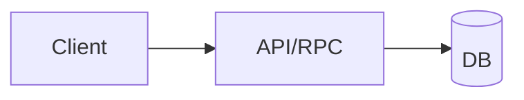

# Phase N — <Tên phase>

> Trạng thái: **DRAFT** · Ngày đổi trạng thái: YYYY-MM-DD · Ước lượng: <tuần> · Spec: §<a>, §<b>
> Mục tiêu: <một câu>.
> Gate để bắt đầu: Gate (N-1)→N pass ✓ <ngày> (hoặc lý do ngoại lệ + ID quyết định).

---

## Bước N.1 — <Tên bước> `[ ]`

### Công việc
1. …
2. …

### Input/Output
```ts
// functionName(input: InputType) → OutputType
//   IN:  …
//   DO:  …
//   OUT: …
//   ERR: <mã lỗi chuẩn>
```

### Data flow (khi đáng vẽ)


### Test
- `UT` …
- `IT` …
- `E2E` …

### Acceptance
- Điều kiện để đánh `[x]` (đo được, có lệnh verify).

---

## Bước N.2 — … `[ ]`

---

## Init data (seed dev/test)
<!-- Dữ liệu mẫu; chỉ fixture, không dữ liệu thật (00-core §5.1). -->

## Gate N→N+1 (tất cả phải pass)

- [ ] Toàn bộ UT/IT/E2E xanh trong CI. *(bằng chứng: run #, ngày)*
- [ ] Kiểm thử thủ công trên môi trường/thiết bị thật theo user journey. *(bằng chứng)*
- [ ] Security review checklist (coding.md §5 + skill stack §3) đã rà. *(bằng chứng)*
- [ ] Tài liệu cập nhật: spec §…, skill stack, tài liệu schema/contract. *(bằng chứng)*
- [ ] Quyết định `proposed` thuộc phase này đã được PO chốt (index "Đang mở" không còn mục phase N).
